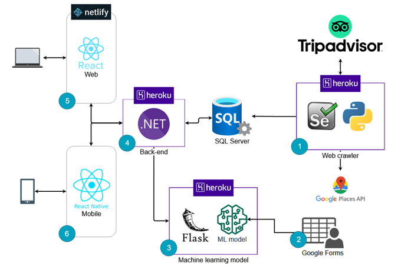

<h1 align='center'>
  
</h1>

<p align="center">
  <a href="#book-about">About</a>&nbsp;&nbsp;&nbsp;|&nbsp;&nbsp;&nbsp;
  <a href="#%EF%B8%8F-technologies">Technologies</a>&nbsp;&nbsp;&nbsp;|&nbsp;&nbsp;&nbsp;
  <a href="#cityscape-solution-architecture">Solution architecture</a>&nbsp;&nbsp;&nbsp;|&nbsp;&nbsp;&nbsp;
  <a href="#computer-running-the-web-crawler">Running the web crawler</a>&nbsp;&nbsp;&nbsp;|&nbsp;&nbsp;&nbsp;
  <a href="#whale-running-with-docker">Running with Docker</a>
</p>

<p align="center">
  
</p>

## :book: About

Web crawler that applies web scraping techniques to get informations from the TripAdvisor website to about restaurants and touristic spots in the Grande ABC region. 
Also, it is being used the Google Places API to get detailed informations (like address, opening hours, geolocation, phone and many others properties) about these places and all of these informations are being stored in a database (you can choose your database, but it was tested only with SQLite and SQL Server).

## ⚒️ Technologies

- [Python](https://www.python.org/)
- [Selenium](https://www.selenium.dev/)
- [SQLAlchemy](https://www.sqlalchemy.org/)
- [Google Places API](https://developers.google.com/maps/documentation/places/web-service/overview)

## :cityscape: Solution architecture
This repository is represented by the number 1 in the architecture, if you want to view the other repositories of the solution, click on one of the items below:

<p align="center">
  
</p>

- [(3) Machine Learning](https://github.com/iae-bora/ml-api)
- [(4) Back-End](https://github.com/iae-bora/back-end)
- [(5) Front-End](https://github.com/iae-bora/front-end)
- [(6) Mobile](https://github.com/iae-bora/mobile)

## :computer: Running the web crawler

1. Install the project dependencies
```
$ pip install -r requirements.txt
```

2. Follow [these steps](https://chromedriver.chromium.org/getting-started) to download ChromeDriver binary.

3. Create a `.env` file based on the `.env.example` file
```
$ cp .env.example .env
```

4. Complete the `.env`file with the requested informations (in this project, we are using SQL Server as our database, but, if you want to use SQLite, don't add the DATABASE_URL in the `.env`file)

5. Create the tables and add basic data to your database (categories and cities list)
```
$ python database/migrations.py
```

6. Run the web crawler
```
$ python main.py
```

7. The application will start running in the background (headless mode).

## :whale: Running with Docker

1. Run the following commands in the cmd
```
$ docker build -t <CONTAINER_NAME>:latest .
$ docker run <CONTAINER_NAME>:latest
```

2. The application will start running when the container starts.
